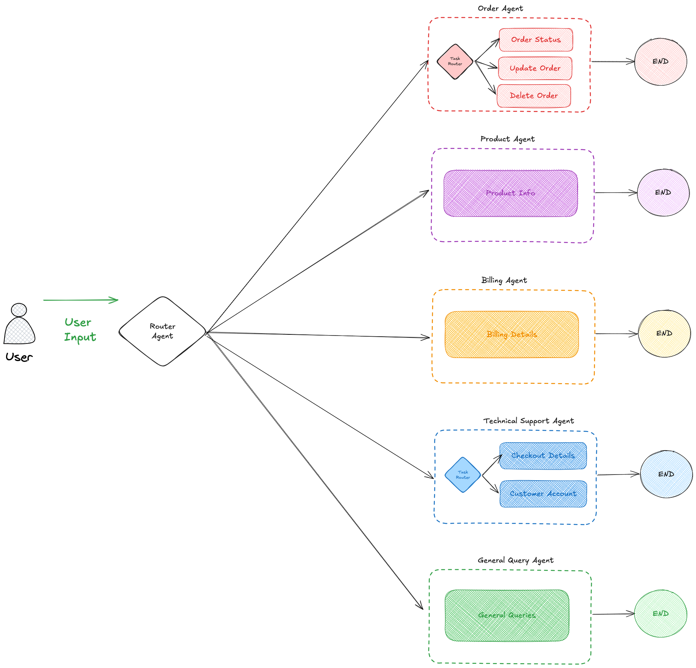

# LangGraph Routing Examples: Customer Service Agent

A comprehensive implementation of different routing strategies in LangGraph for building intelligent agent workflows. This project demonstrates four distinct routing approaches using a realistic customer service use case.




## 🎯 Overview

This project showcases how to implement different routing mechanisms in LangGraph to direct user queries to appropriate specialized handlers. Using a customer service scenario, we demonstrate how different types of customer inquiries can be automatically routed to the right department or handler.

## 🚀 Features

- **Four Routing Methods**: LLM-based, Embedding-based, Rule-based, and ML Model-based routing
- **Complete LangGraph Implementation**: Production-ready workflow graphs
- **Realistic Use Case**: Customer service agent with specialized handlers
- **Confidence Scoring**: Each routing method provides confidence levels
- **Pickle Model Persistence**: ML models are saved and loaded for efficiency
- **Comparative Analysis**: Side-by-side comparison of all routing methods

## 📋 Use Case: Customer Service Agent

The system routes customer inquiries to specialized handlers:

- **Order Status** 📦 - Order tracking, delivery, shipping questions
- **Product Info** 🛍️ - Product specifications, availability, features
- **Technical Support** 🔧 - Troubleshooting, bugs, technical issues
- **Billing** 💳 - Payment, refunds, billing inquiries
- **General** ❓ - General questions and other inquiries

## 🔀 Routing Methods

### 1. LLM-Based Routing
- Uses language model prompts to analyze and classify queries
- **Pros**: Most flexible, handles nuanced language well
- **Cons**: Slower, requires LLM API calls, potentially expensive
- **Best for**: Complex queries with ambiguous intent

### 2. Embedding-Based Routing
- Converts queries to vector embeddings and finds semantic similarity
- **Pros**: Good semantic understanding, handles synonyms
- **Cons**: Requires embedding model, fixed categories
- **Best for**: Semantic routing beyond simple keywords

### 3. Rule-Based Routing
- Uses regex patterns and keyword matching
- **Pros**: Fast, predictable, deterministic
- **Cons**: Limited flexibility, requires manual rule maintenance
- **Best for**: Well-defined patterns and keywords

### 4. ML Model-Based Routing
- Uses trained classifier with pickle persistence
- **Pros**: Fast inference, good accuracy, no API calls
- **Cons**: Requires training data, less flexible than LLM
- **Best for**: Production systems with consistent query patterns

## 🛠️ Installation

```bash
# Install required packages
pip install langgraph
pip install sentence-transformers
pip install scikit-learn
pip install numpy
pip install openai  # Optional, for actual LLM integration
```

## 📦 Dependencies

```python
langgraph>=0.1.0
sentence-transformers>=2.0.0
scikit-learn>=1.0.0
numpy>=1.20.0
typing-extensions>=4.0.0
```

## 🚦 Quick Start

```python customer_service_agent.py
```

## 📊 Running the Demo

```python
# Run the complete demonstration
python customer_service_agent.py
```

This will:
1. Test all four routing methods on sample queries
2. Show confidence scores for each method
3. Create/load the ML classifier pickle file
4. Display comparative results


### Customizing Routes
Add new routes by updating the handler functions and route categories:

```python
# Add new route category
def handle_returns(state: CustomerServiceState) -> CustomerServiceState:
    response = "I'll help you process your return..."
    state["response"] = response
    return state

# Update routing logic in each method accordingly
```

### ML Model Training
The ML classifier automatically:
- Creates a new model on first run
- Saves to `customer_service_classifier.pkl`
- Loads the saved model on subsequent runs

To retrain the model, simply delete the pickle file.

## 📈 Performance Comparison

| Method | Speed | Accuracy | Flexibility | Cost |
|--------|-------|----------|-------------|------|
| LLM | Slow | High | Very High | High |
| Embedding | Medium | High | High | Low |
| Rule-based | Fast | Medium | Low | Very Low |
| ML Model | Fast | High | Medium | Very Low |

## 🎯 Sample Queries and Expected Routes

```python
test_queries = [
    ("Where is my order?", "order_status"),
    ("What are the specs?", "product_info"),
    ("App keeps crashing", "technical_support"),
    ("Wrong charge on card", "billing"),
    ("General question", "general")
]
```

## 🔄 Extending the System

### Adding New Routing Methods
1. Create a new routing function in `CustomerServiceRouter`
2. Add a corresponding node function
3. Update `create_routing_graph()` to include the new method


## 🚀 Production Considerations

- **Caching**: Implement caching for embedding-based routing
- **Monitoring**: Add logging and metrics for routing decisions
- **A/B Testing**: Compare routing method performance
- **Fallbacks**: Implement fallback routing when confidence is low
- **Rate Limiting**: Add rate limiting for LLM-based routing

## 🤝 Contributing

1. Fork the repository
2. Create a feature branch
3. Add your routing method or improvement
4. Include tests and documentation
5. Submit a pull request

## 📝 License

MIT License - see LICENSE file for details

## 🙋‍♂️ Support

For questions or issues:
- Open an issue in the repository
- Check the documentation for LangGraph
- Review the code comments for implementation details

## 🔗 Related Resources

- [LangGraph Documentation](https://python.langchain.com/docs/langgraph)
- [Scikit-learn Classification](https://scikit-learn.org/stable/modules/classification.html)

---

**Built with ❤️ using LangGraph and Python**